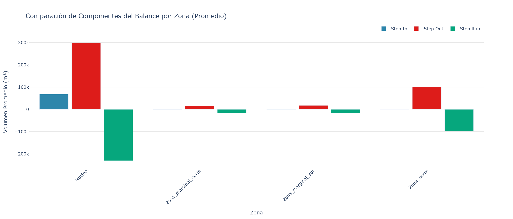
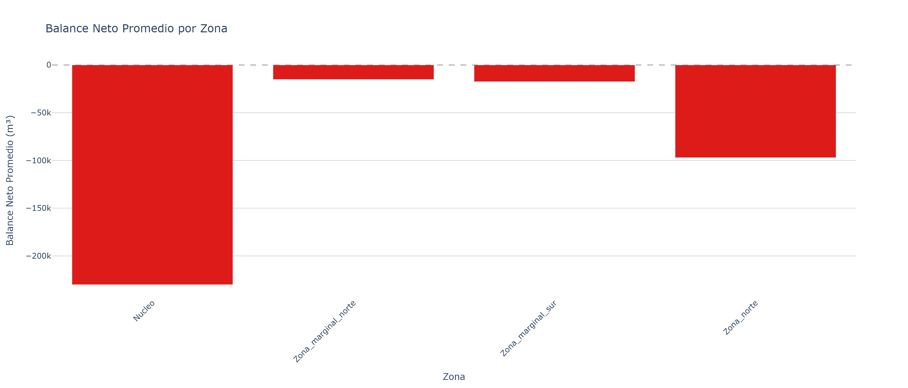
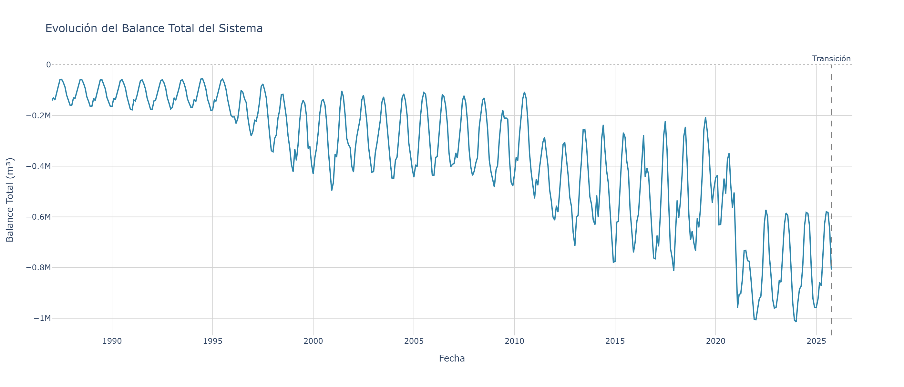
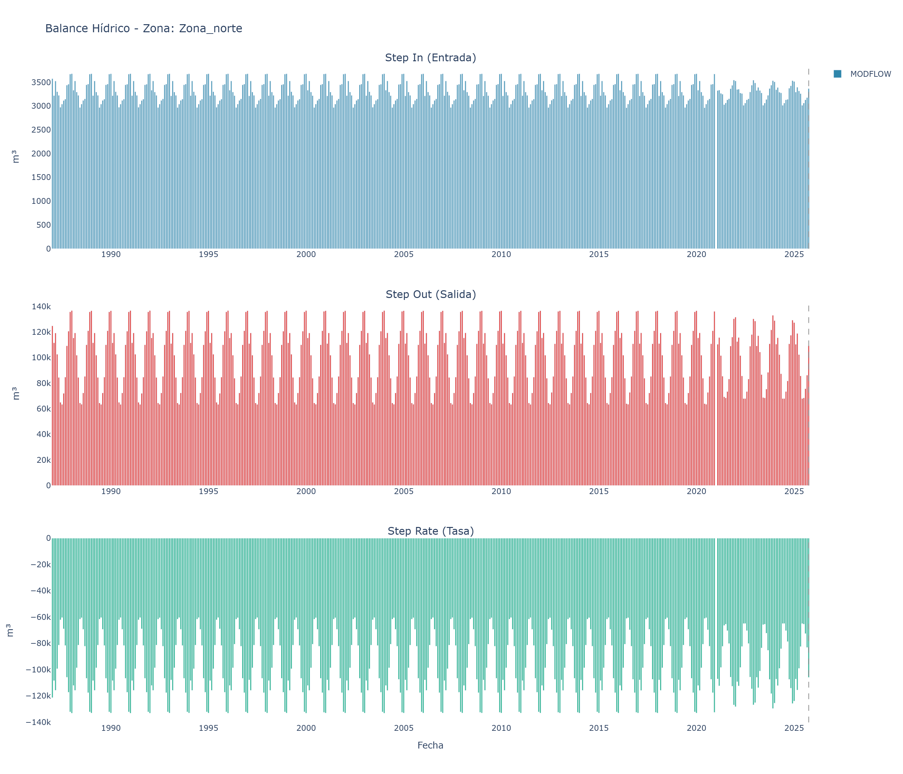
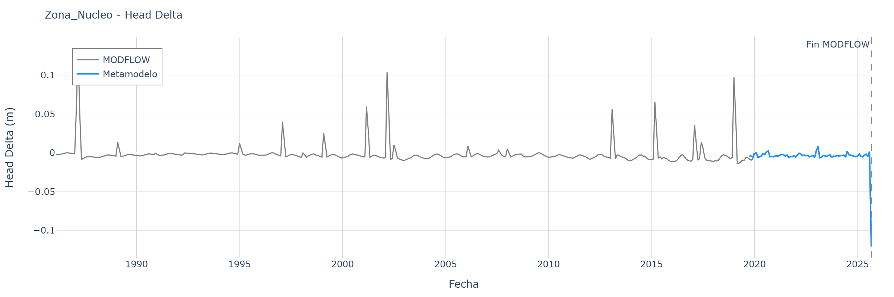
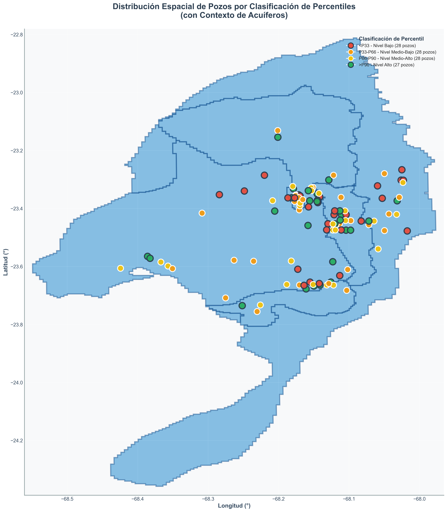
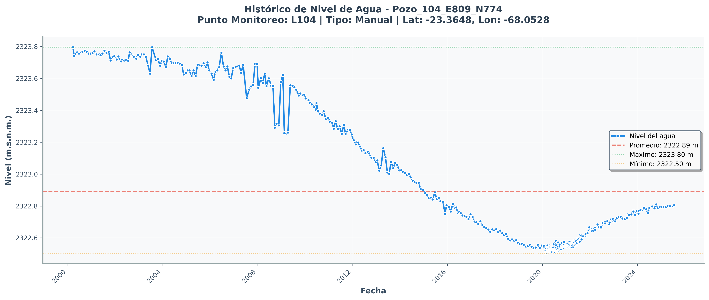
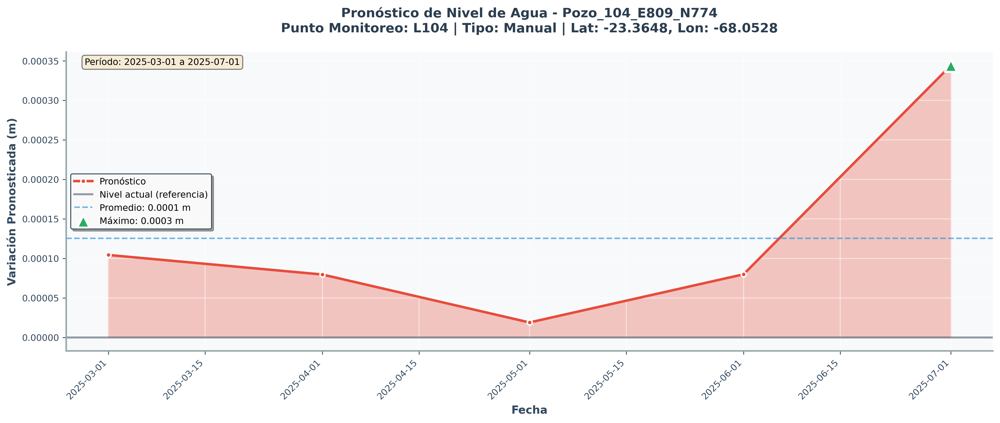

# Ejemplos de Visualización de Datos Hidrogeológicos

Este repositorio contiene scripts de ejemplo para generar gráficos y visualizaciones a partir de la API de monitoreo hidrogeológico.

## 📋 Descripción

Estos scripts demuestran cómo consumir datos de la API y generar visualizaciones automáticas para análisis hidrogeológico. Todos los gráficos se guardan como imágenes PNG de alta resolución en la carpeta `outputs/`.

## 🚀 Instalación

1. Instalar las dependencias necesarias:

```bash
pip install -r requirements.txt
```

## 📊 Scripts Disponibles

### 1. `cota.py` - Niveles de Agua (Head)

Genera gráficos de línea temporal para niveles de agua en diferentes zonas hidrogeológicas.

**Qué hace:**
- Obtiene datos históricos y pronósticos de MODFLOW para cada zona
- Crea gráficos de **Head Absoluto** (nivel absoluto del agua)
- Crea gráficos de **Head Delta** (variación del nivel)
- Marca visualmente la transición entre datos históricos y pronósticos

**API endpoints utilizados:**
- `GET /api/v1/metamodelos/zonas` - Lista de zonas disponibles
- `GET /api/v1/metamodelos/metamodelo-mensual-head-absoluto-historico` - Datos históricos head absoluto
- `GET /api/v1/metamodelos/metamodelo-mensual-head-absoluto-modelacion` - Pronóstico head absoluto
- `GET /api/v1/metamodelos/metamodelo-mensual-head-delta-historico` - Datos históricos head delta
- `GET /api/v1/metamodelos/metamodelo-mensual-head-delta-modelacion` - Pronóstico head delta

**Ejecutar:**
```bash
python cota.py
```

**Resultado:** 10 gráficos PNG (2 por cada una de las 5 zonas)

---

### 2. `balance.py` - Balance Hídrico

Genera gráficos de barras para el balance hídrico mensual de cada zona, además de análisis comparativos entre todas las zonas.

**Qué hace:**
- Visualiza las entradas y salidas de agua (Step In, Step Out, Step Rate)
- Compara datos históricos de MODFLOW con pronósticos del metamodelo
- Crea gráficos individuales por variable y gráficos combinados por zona
- **NUEVO:** Genera gráficos comparativos entre todas las zonas
- **NUEVO:** Calcula y visualiza el balance neto (entradas - salidas)
- **NUEVO:** Muestra la evolución temporal del balance total del sistema

**API endpoints utilizados:**
- `GET /api/v1/metamodelos/balance/zones` - Lista de zonas con balance hídrico
- `GET /api/v1/metamodelos/balance/metamodelo-mensual-balance-historico` - Datos históricos de balance
- `GET /api/v1/metamodelos/balance/metamodelo-mensual-balance-modelacion` - Pronóstico de balance

**Ejecutar:**
```bash
python balance.py
```

**Resultado:** 19 gráficos PNG
- **Por zona (16 gráficos):** 4 zonas × 4 gráficos cada una
  - 3 gráficos individuales (entrada, salida, tasa)
  - 1 gráfico combinado con las 3 variables
- **Comparativos (3 gráficos):**
  - 1 comparación de componentes por zona (barras agrupadas)
  - 1 balance neto por zona (barras con colores verde/rojo)
  - 1 evolución del balance total del sistema (líneas temporales)

---

### 3. `grafico_pozos.py` - Distribución Espacial de Pozos

Crea un mapa con la ubicación de todos los pozos de monitoreo.

**Qué hace:**
- Muestra la ubicación geográfica de 111 pozos de monitoreo
- Clasifica pozos por percentiles de nivel (colores según criticidad)
- Dibuja las zonas del acuífero como contexto (polígonos azules)
- Transforma coordenadas UTM a latitud/longitud

**API endpoints utilizados:**
- `GET /api/v1/plataforma-pozos/pozos-nivel-geojson` - GeoJSON con pozos y clasificación por percentiles
- `GET /api/v1/metamodelos/metamodelos-zonas-geojson` - GeoJSON con polígonos de zonas hidrogeológicas

**Ejecutar:**
```bash
python grafico_pozos.py
```

**Resultado:** 1 gráfico PNG con el mapa completo

**Clasificación por colores:**
- 🔴 Rojo: Nivel bajo (<P33)
- 🟠 Naranja: Nivel medio-bajo (P33-P66)
- 🟡 Amarillo: Nivel medio-alto (P66-P90)
- 🟢 Verde: Nivel alto (>P90)

---

### 4. `pozos_historicos.py` - Series Temporales de Pozos

Genera gráficos del histórico de niveles de agua para pozos individuales.

**Qué hace:**
- Muestra la evolución temporal del nivel de agua en pozos específicos
- Calcula y visualiza estadísticas (promedio, máximo, mínimo)
- Crea un gráfico comparativo entre múltiples pozos
- Procesa 3 pozos de ejemplo (L104, L3, L16)

**API endpoints utilizados:**
- `GET /api/v1/plataforma-pozos/listado-pozos` - Lista completa de pozos disponibles (111 pozos)
- `GET /api/v1/plataforma-pozos/pozos-data/{pozo_id}` - Datos históricos de un pozo específico

**Ejecutar:**
```bash
python pozos_historicos.py
```

**Resultado:** 4 gráficos PNG
- 3 gráficos individuales (uno por pozo)
- 1 gráfico comparativo con los 3 pozos

---

### 5. `pronostico.py` - Pronósticos de Pozos

Genera gráficos de pronósticos futuros de niveles de agua para pozos específicos.

**Qué hace:**
- Visualiza las variaciones pronosticadas del nivel de agua
- Muestra tendencias futuras con áreas sombreadas
- Marca valores máximos y mínimos esperados
- Combina datos de pronóstico con información completa del pozo (coordenadas, tipo)
- Procesa 3 pozos de ejemplo (L104, L3, L16)

**API endpoints utilizados:**
- `GET /api/v1/salida/pronostico-pozos/listado` - Lista de pozos con pronósticos disponibles (105 pozos)
- `GET /api/v1/salida/pronostico-pozos-data/{pozo_id}` - Datos de pronóstico para un pozo específico
- `GET /api/v1/plataforma-pozos/pozos-data/{pozo_id}` - Información completa del pozo (coordenadas, punto monitoreo)

**Ejecutar:**
```bash
python pronostico.py
```

**Resultado:** 4 gráficos PNG
- 3 gráficos individuales de pronóstico (uno por pozo)
- 1 gráfico comparativo de pronósticos

---

## 📁 Estructura de Archivos

```
graficos/
├── cota.py                    # Script de niveles de agua
├── balance.py                 # Script de balance hídrico
├── grafico_pozos.py           # Script de distribución espacial
├── pozos_historicos.py        # Script de históricos de pozos
├── pronostico.py              # Script de pronósticos de pozos
├── requirements.txt           # Dependencias del proyecto
├── README.md                  # Este archivo
└── outputs/                   # Carpeta con gráficos generados (se crea automáticamente)
    ├── Nucleo_head_absoluto.png
    ├── Nucleo_balance_step_in.png
    ├── distribucion_pozos_percentiles.png
    ├── Pozo_104_E809_N774_historico.png
    ├── Pozo_104_E809_N774_pronostico.png
    └── ... (35 gráficos en total)
```

## 🔧 Dependencias

- **requests** - Para consultar la API
- **pandas** - Procesamiento de datos tabulares
- **plotly** - Gráficos interactivos y de línea/barras
- **matplotlib** - Gráficos estáticos
- **kaleido** - Exportación de gráficos Plotly a PNG
- **pyproj** - Transformación de coordenadas geográficas
- **numpy** - Operaciones numéricas

## 🌐 API Utilizada

Todos los scripts consumen datos de:
```
https://hydromet4api.hidrofuturo.cl/api/v1/
```

**Endpoints principales:**
- `/metamodelos/zonas` - Zonas hidrogeológicas
- `/metamodelos/balance/` - Balance hídrico
- `/plataforma-pozos/` - Datos de pozos de monitoreo
- `/salida/pronostico-pozos/` - Pronósticos de pozos

## 📸 Salida

Todos los gráficos se generan en formato PNG con alta resolución (300 DPI) y se guardan automáticamente en la carpeta `outputs/`.

**Total de gráficos generados:** 38 imágenes
- 10 gráficos de niveles de agua (cota)
- 19 gráficos de balance hídrico (incluye 3 comparativos)
- 1 gráfico de distribución espacial de pozos
- 4 gráficos de históricos de pozos
- 4 gráficos de pronósticos de pozos

## ⚙️ Características Técnicas

- ✅ Sin dependencia de archivos locales (todo desde API)
- ✅ Gráficos estáticos sin controles interactivos
- ✅ Alta resolución para reportes e impresión
- ✅ Procesamiento automático de todas las zonas disponibles
- ✅ Manejo de geometrías complejas (Polygon y MultiPolygon)

## 📝 Notas

- Los scripts crean la carpeta `outputs/` automáticamente si no existe
- Cada ejecución sobrescribe los gráficos anteriores
- Los datos se obtienen en tiempo real desde la API
- Las fechas se convierten automáticamente al formato adecuado

## 🤝 Uso

Estos scripts son ejemplos de referencia. Puedes modificarlos para:
- Cambiar los pozos analizados en `pozos_historicos.py`
- Ajustar colores y estilos de los gráficos
- Modificar las dimensiones de las imágenes
- Agregar más métricas o estadísticas

---

## 📊 Ejemplos de Gráficos Generados

### Balance Hídrico - Gráficos Comparativos

#### 1. Comparación de Componentes por Zona
Barras agrupadas mostrando Step In (entradas), Step Out (salidas) y Step Rate (tasa) promedio para cada zona.



#### 2. Balance Neto por Zona
Balance neto promedio (entradas - salidas) con colores verde (positivo) y rojo (negativo).



#### 3. Evolución del Balance Total del Sistema
Serie temporal del balance total combinando datos históricos (MODFLOW) y pronósticos (Metamodelo).



### Balance Hídrico - Gráfico Individual por Zona

Ejemplo de gráfico combinado para una zona específica mostrando las tres variables del balance.



### Niveles de Agua (Head)

#### Head Absoluto
Evolución temporal del nivel absoluto del agua en una zona.


#### Head Delta
Variación del nivel de agua respecto a un punto de referencia.



### Distribución Espacial de Pozos

Mapa con la ubicación de todos los pozos de monitoreo clasificados por percentiles de nivel.



### Histórico de Pozos

Serie temporal del nivel de agua en un pozo específico con estadísticas (promedio, máximo, mínimo).



### Pronóstico de Pozos

Pronóstico futuro de la variación del nivel de agua en un pozo específico.



---

## 📧 Contacto

Para más información sobre la API, consulta la documentación completa en:
https://hydromet4api.hidrofuturo.cl/docs
